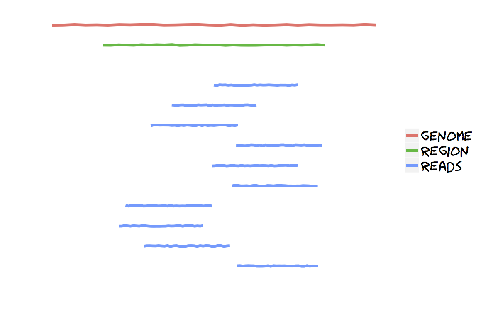
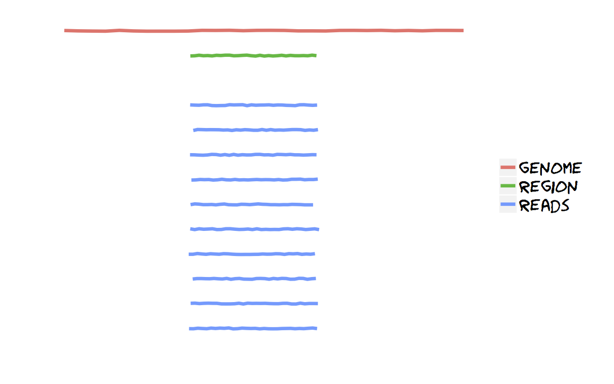

### Generally speaking
Two kinds of local analysis are possible, one invoked by the program `dec.py`,
the other by `amplian.py`. We will define these two as shotgun mode (albeit
improperly) and amplicon mode. The input is always a [sorted bam
file](input.html). The window size should be slightly smaller than the read
length.

#### Shotgun mode: region longer than the reads

This is performed when the amplicon is longer than the typical read length and
we don't want to focus our analysis on a specific region of this amplicon.
`dec.py` cuts on the aligment a set of overlapping regions (parameters can be
adjusted, run `dec.py -h` for help), and passes them to `diri_sampler` for error
correction and local haplotype reconstruction. This is the first step of the
[global analysis](global.html). Additionally, it runs `snv.py` for SNV calling.

#### Amplicon mode: region covered by a single read

When the amplicon size is smaller than the read length or comparable to it, it
is in general more appropriate to use `amplian.py`, which extracts the multiple
alignment corresponding to the specified amplicon. By default, this includes
reads that cover at least 95% of the amplicon region (this can be adjusted
with the option `-m MIN_OVERLAP`). It then runs `diri_sampler` for error
correction and `snv.py` for SNV calling.

### Examples
#### Shotgun mode: `dec.py`
Run `dec.py -h` for help.

    [user@host]$ dec.py -h
	Usage: dec.py [options]

	Options:
	  -h, --help            show this help message and exit

	  Input files:
	    Required input

	    -b IN_BAM, --bam=IN_BAM
	                        file with aligned reads in .bam format
	    -f IN_FASTA, --fasta=IN_FASTA
	                        reference genome in fasta format
    . . . more options . . .
You should specify the window size (default is 201). Intermediate files are
now kept by default. Next line runs with a window length of 300
and keeps intermediate files. `ref_file.fasta` contains the reference sequence
that has been used to align reads.

    [user@host]$ dec.py -b my_sorted_bam.bam -f ref_file.fasta -w 300 -k

#### Amplicon mode: `amplian.py`
As usual, the help is available with `-h`.

    [user@host]$ amplian.py -b my_sorted_bam.bam -f amplicon.fasta -m 0.95

`amplian.py` uses the option `-m` to specify minimum overlap that the reads
are required to have with the amplicon in order to be included (default 95%).
The file `amplicon.fasta` contains the reference sequence used to align reads.
If this is longer than the read length, the user can specify a shorter region
with the option `-r chromosome_name:region_start-region_stop`.

#### Find the highest diversity region
Starting from version 0.8, `amplian` is capable of detecting the region
corresponding to the highest Shannon entropy. The size of the region is the
trimmed mean of the read length (_i.e._ the mean computed on reads between 10th
and 90th percentile of length). This method can be used, for example, if one
is interested in the lower bound on the number of haplotypes. See also our
paper on [PLoS ONE](http://www.plosone.org/article/info%3Adoi%2F10.1371%2Fjournal.pone.0047046)
(figure 1). If [matplotlib](http://matplotlib.org) is installed, a plot of the
entropy is saved in file `entropy.pdf`. All entropy values are saved in the
comma-separated value file `entropy.csv`.

### Output of local analysis
#### Shotgun mode
Suppose we are analyzing a region of 1500 bp, and we chose window size of 300.
By default, windows overlap such that (except for the boundaries of the region)
each base is covered by three windows (option `-s`). So `dec.py` will produce
windows 1-300, 101-400, 201-500, 301-600 and so on. All these are passed to
`diri_sampler` and local haplotype are inferred. For each window there will
be several files produced. We describe here two of these, the **support**
and the **sampling** file.

The support file has the `support.fas` suffix. It is a fasta file with the
reconstructed haplotypes. The header of each sequence contains information on
the quality of the reconstruction (posterior probability of the haplotype) and
the frequency of the haplotype. For example,

    >hap_0|posterior=1 ave_reads=235.168
    CCTCAGATCACTCTTTGGCAACGACCCTTCGTC

indicates that the reconstructed haplotype has a posterior probability of 1 (it
was always present in the sampled Markov chain) and on average 235 reads were
assigned to it. Good results have been obtained by discarding haplotypes with
less than 90-95% support.

`snv.py` takes care of parsing the single nucleotide variants, check the strand
bias and write a CSV file with all the information (suffix `final.csv`) in the
directory `snv`.

#### Amplicon mode
`amplian.py` will analyse a single window, either passed by the user or
determined by the program (see above). Consequently, the output files from the
support to the SNV file will refer to this single window (see shotgun mode
above).

---

Go back [home](index.html)
